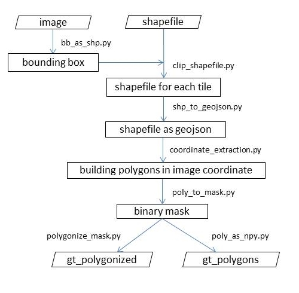

# Evaluation-of-Frame-Field-Learning-for-Orthophotos
An evaluation of the frame field learning technique for extraction of building polygons in vector format from true orthophotos.

This is the code for preparation of dataset from scratch for running a network using the Frame Field Learning technique. The study area is Lower saxony which includes 10 cities as shown below:

The steps can be described as shown in the figure below:

The data required can be downloaded from the link provided below:
....

There are two folders: data_for_training and downloaded_data. The 1st folder contains the ready to use dataset while the 2nd folder contains the raw data which is downloaded from the sources mentioned in the report. The downloaded_data folder must be used to perform the steps mentioned above. 

A step-by-step process is described below:

