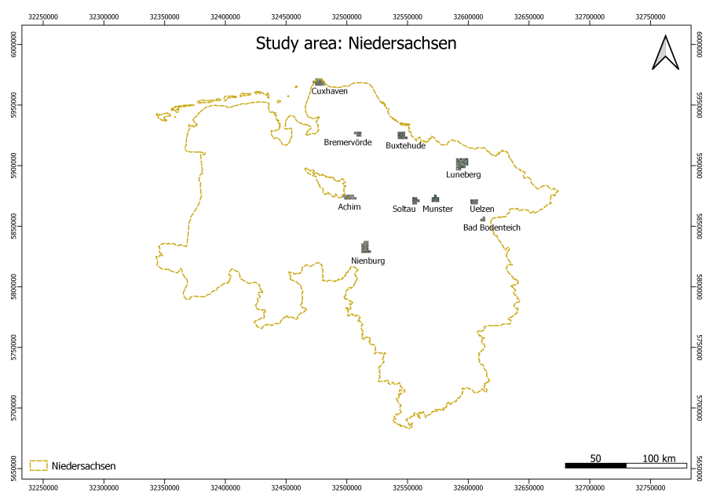

# Evaluation-of-Frame-Field-Learning-for-Orthophotos
An evaluation of the frame field learning technique for extraction of building polygons in vector format from true orthophotos.

This is the code for preparation of dataset from scratch for running a network using the Frame Field Learning technique. The study area is Lower saxony which includes 10 cities as shown below:

We use true orthophotos and shapefiles of building as raw data which is processed to obtained the traninable data. The steps can be described as shown in the figure below:

The data required can be downloaded from the link provided below:

https://tubcloud.tu-berlin.de/s/4SgSPPwHnbidx9c

There are two folders: data_for_training and downloaded_data. The 1st folder contains the ready to use dataset which can be downloaded and saved as named on the link.
The final data used for training is described as below:

1. images: The renamed image tiles as tifs (obtained after running rename.py)
2. gt: Ground truth binary masks (obtained after running poly_to_binary_mask.py)
3. gt_polygons: The numpy files of building polygons (obtained after running to_npy.py)
4. gt_polygonized: Not obtained here, the polygonization algorithm suggested by the original paper needs to be implemented. Explained in detail in the report.

The 2nd folder contains the raw data which is downloaded from the sources mentioned in the report. The downloaded_data folder must be used to perform the steps mentioned above. The images and shapefiles must be saved as subfolders in a folder named data e.g. data/images and data/shapefiles.

A step-by-step process is described below:

1. Run python rename.py - obtain images
2. Run python bb_as_shp.py

!!! ATTENTION !!! 

Direct implementation is not possible from here on below as the folderwise operations have not been implemented yet. Therefore, the folder names must be changed for each folder and new folders must be manually created. The codes work so they can be used for test but it is time consuming at the moment. Updates will be made soon.

3. Run clip_shapefile.py
4. Run shp_to_geojson.py
5. Run coordinate_extraction.py
6. Run poly_to_binary_mask.py - obtain gt
7. Run to_npy.py - obtain gt_polygons

The python file with utility written on the description are helping functions which are frequetly used in different codes e.g. for getting directory, extracting bounding box and creating folders.

